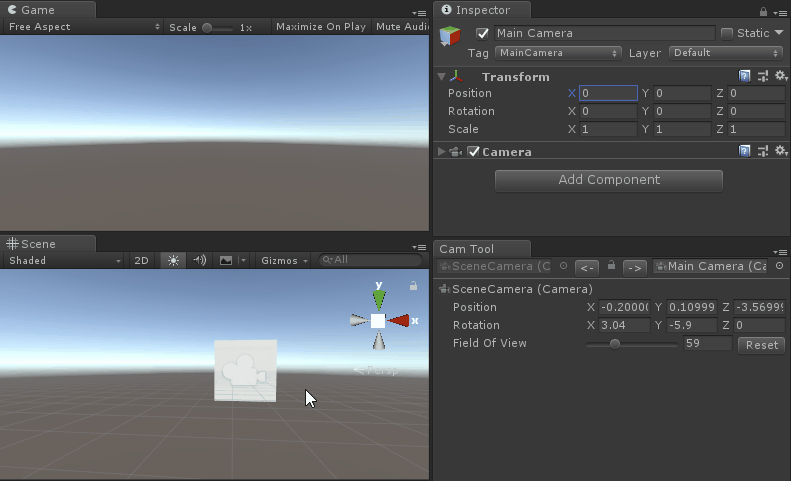

A Unity editor tool to sync scene view camera and the game camera.

I think you can get the idea pretty quick from the gif.

## How to

1. Copy the script into any of your Editor folder in the project.
2. Open menu item "Window/SceneView Cam Tool".

## Compatibility
The tool has been tested in Unity 2018.1.x and 2018.3.b. But in theory it can also be used in previous ones like 2017 and 5.6.
